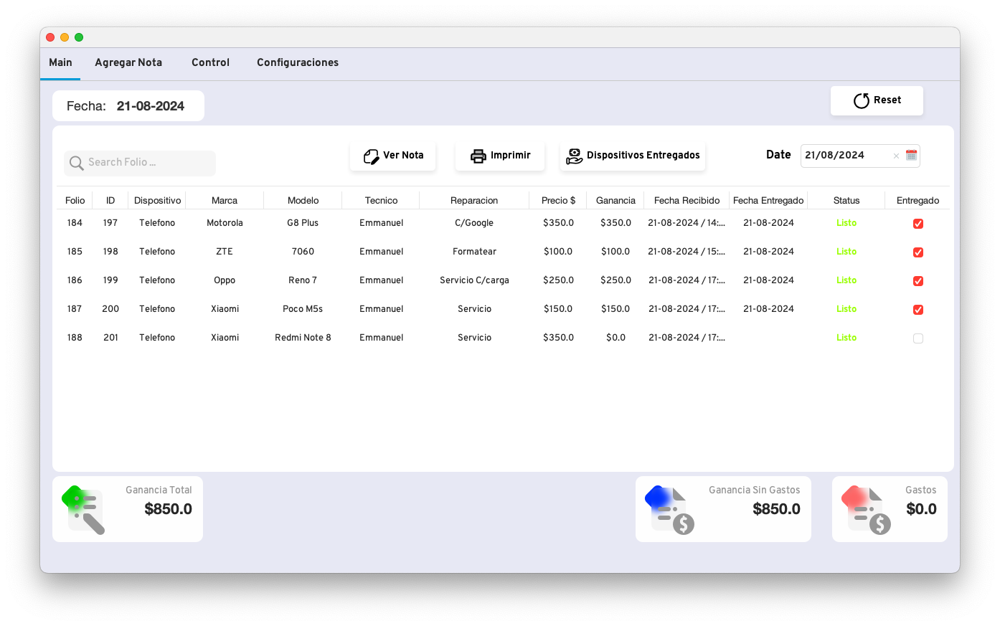
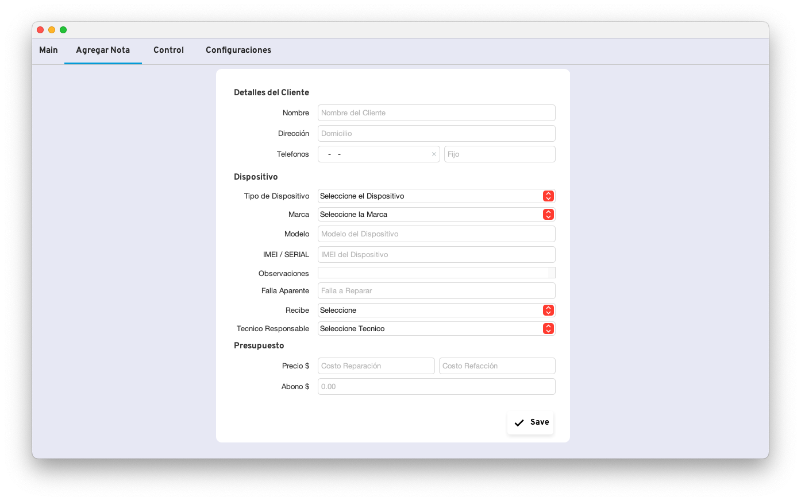
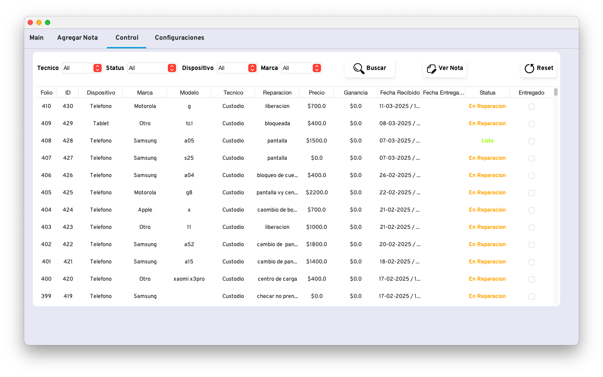
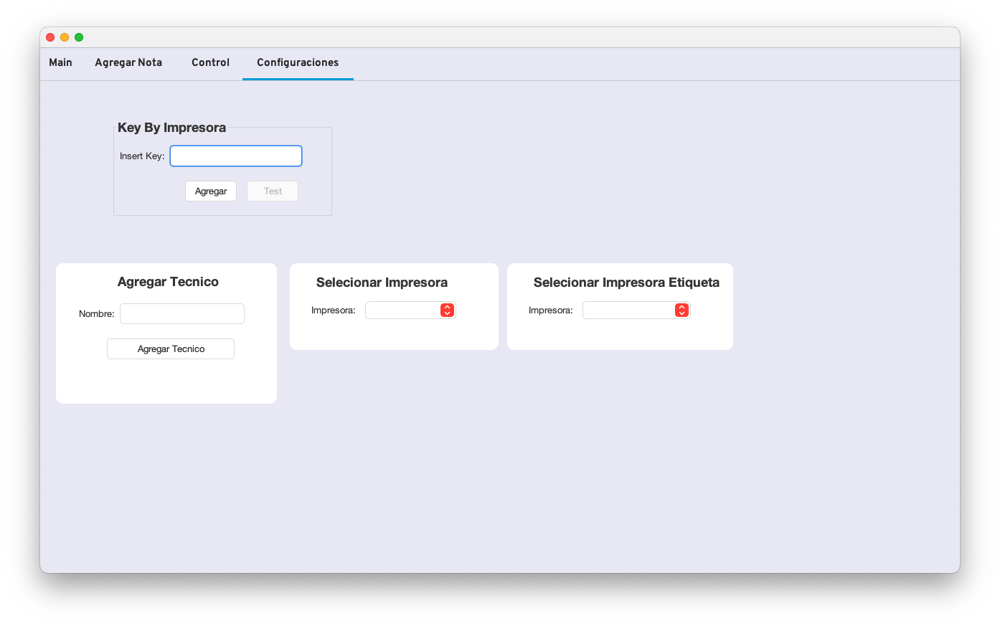
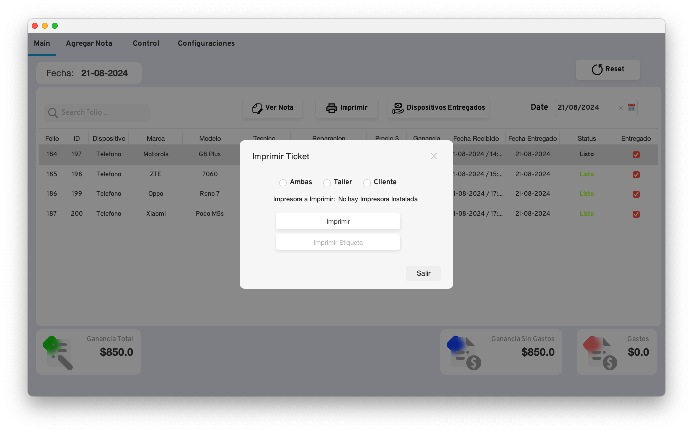
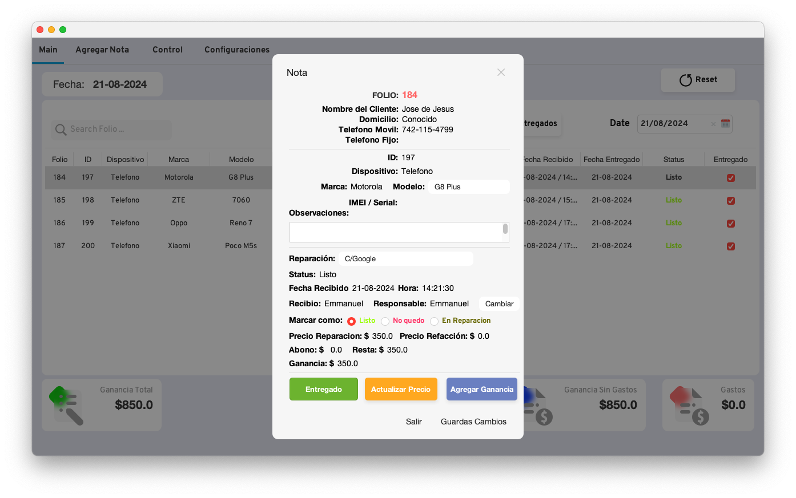
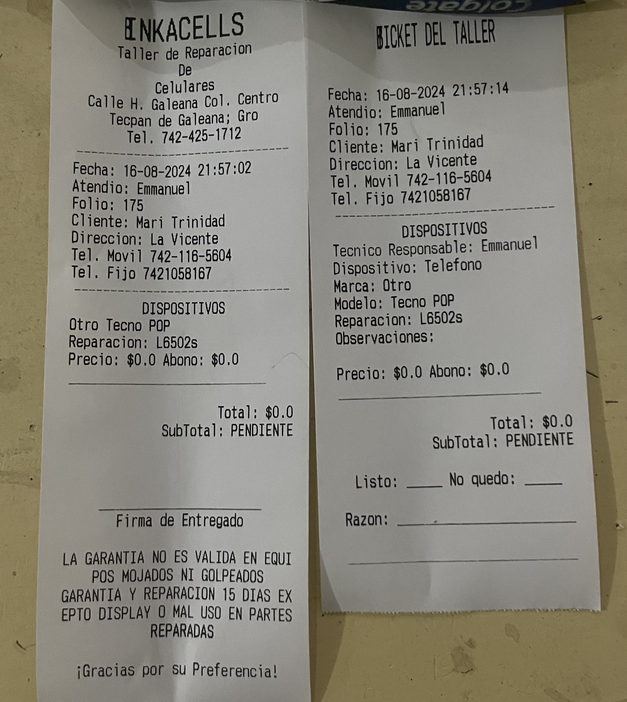

# 📱 Sistema de Gestión de Notas para Taller de Celulares (Inkacells)
Software Gestión de Taller de Celulares

Este software fue desarrollado para facilitar la administración de reparaciones en un taller de celulares. Permite la creación, consulta y gestión de notas de servicio, asociando técnicos, fechas, dispositivos y detalles de reparación.

## ✨ Características principales

- **Creación de notas de reparación** con detalles del cliente, dispositivo, diagnóstico, reparaciones realizadas, precios y abonos.
- **Visualización y búsqueda avanzada** de notas por técnico, fecha o número de nota.
- **Generación e impresión de tickets** para entregar al cliente.
- **Gestión de técnicos** y asignación a cada nota.
- Interfaz de usuario desarrollada con **Java Swing** en **NetBeans**.
- Persistencia de datos mediante **MySQL** como base de datos.

## 🛠️ Tecnologías utilizadas

- Java (Swing)
- NetBeans IDE
- MySQL
- JDBC

## 🖼️ Capturas de pantalla

### Pantalla principal

### Formulario de nueva nota

### Búsqueda de notas

### Configuraciones

### Imprimir Ticket

### Visualizar Nota

### Ticket de impresión

> Este proyecto fue una solución interna desarrollada para mejorar la organización y seguimiento de reparaciones en un entorno de taller técnico.
